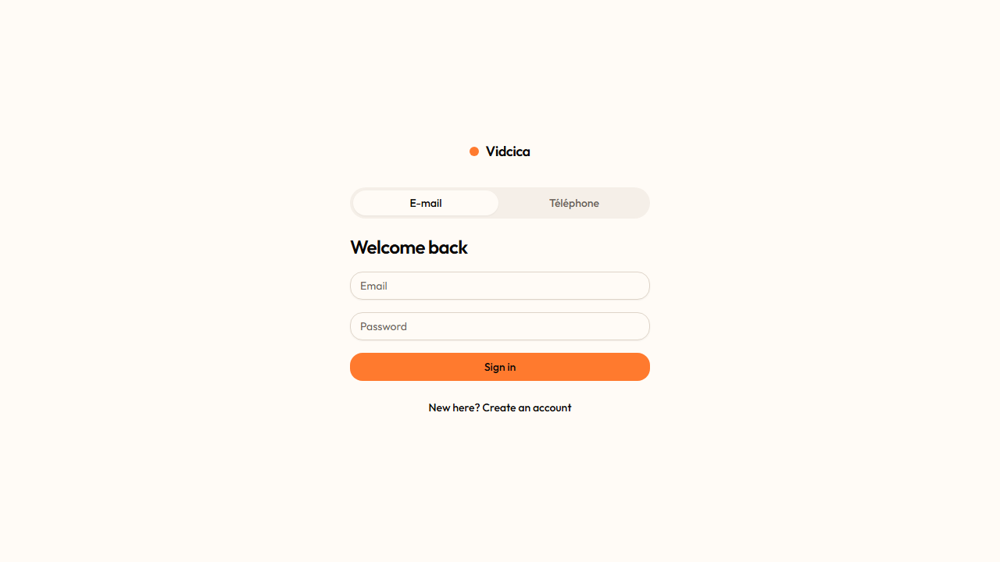
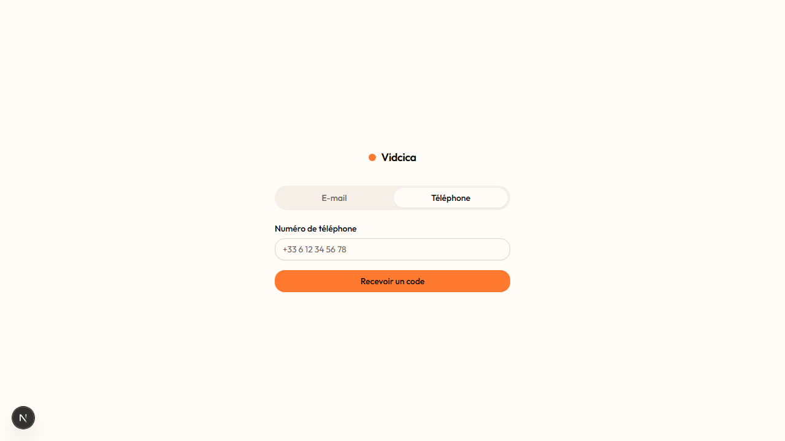
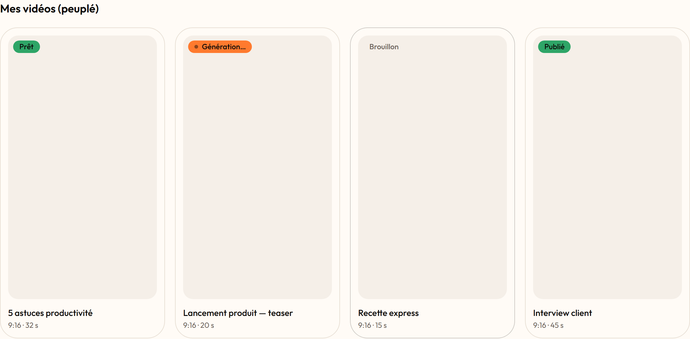
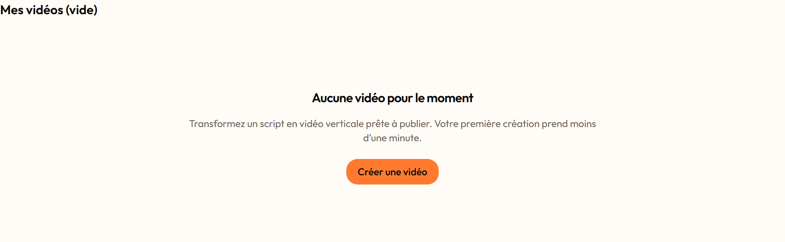
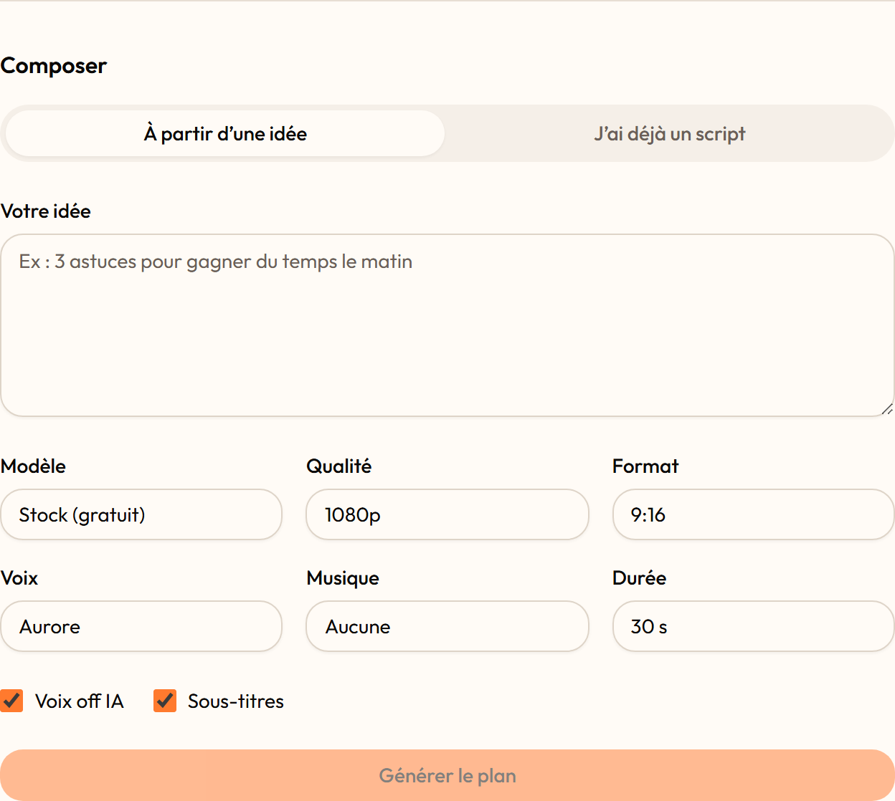
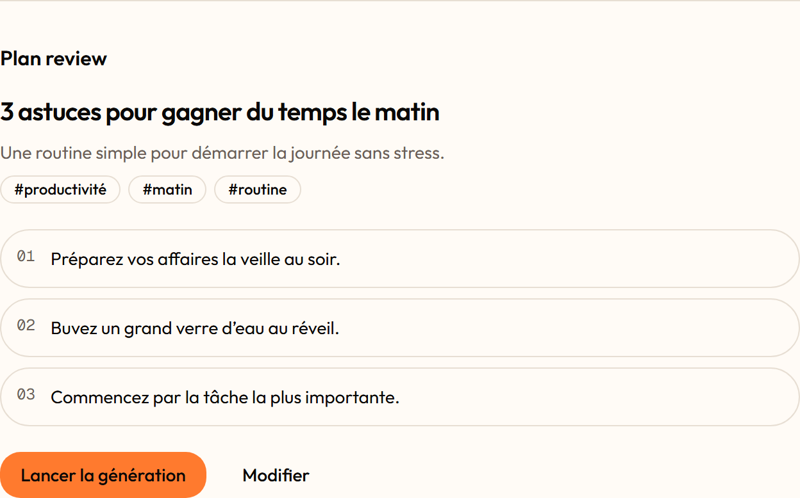
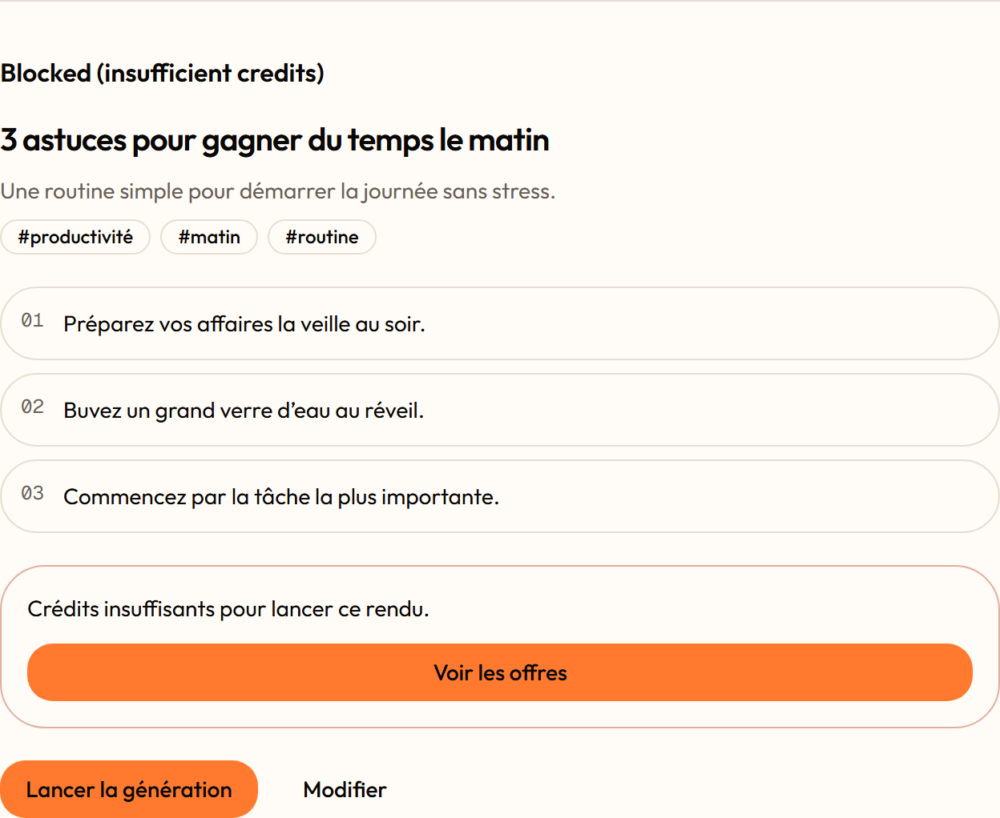
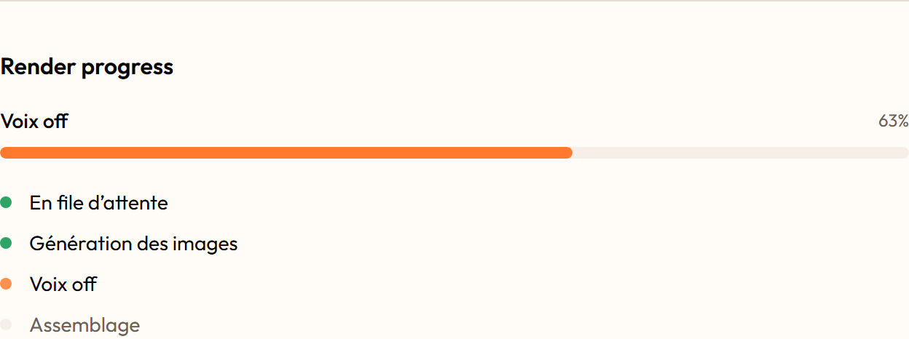
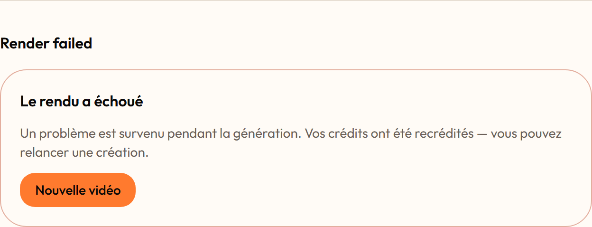
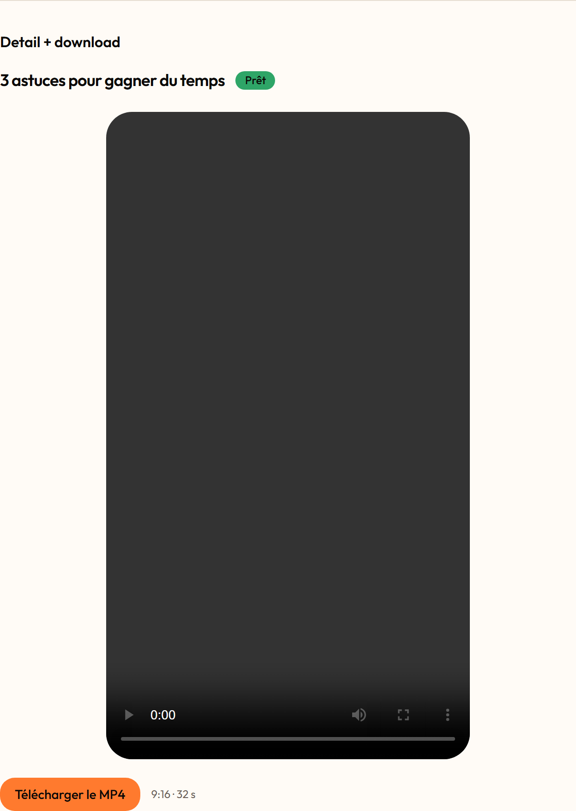

# Feature report — 002 P0 video workspace

- **Spec:** [specs/002-video-workspace-p0](../../specs/002-video-workspace-p0/spec.md) · **Status:** verified (branch `feat/006-support`, stacked on `main`)
- **Date:** 2026-07-13 · **Author:** Houssem Ferrani (product) + Claude (agent-implemented, persona-reviewed)
- **Scope:** 82 files changed · +3,189 / −129 · 12 test files · commits `dd853b1…44ce1a8`

## What & why

Vidcica ships as a mobile app over a live Supabase backend, but there was no desktop workspace. This slice builds the core loop the whole product exists for — **sign in → see your videos live → create one from a script → watch it render stage by stage → download the MP4** — by reusing the same edge functions and tables that already render for mobile (`generate-plan`, `enqueue-generation`, `videos`, `generation_jobs`, the `videos:{userId}` realtime channel). It is integration, not new capability: **no new backend, no migrations**; publishing, ads, and billing UI layer on top of this loop afterwards.

## Acceptance criteria → evidence

| AC                                  | Proven by                                                                                                                                       | Evidence                                                                  | Verdict |
| ----------------------------------- | ----------------------------------------------------------------------------------------------------------------------------------------------- | ------------------------------------------------------------------------- | ------- |
| AC-1 sign-in (password) → dashboard | `e2e/create-video.spec.ts` (sign-in surface + guard); full authed step gated on seeded user                                                     | [signin-email](002-video-workspace-p0/img/signin-email.png)               | PASS¹   |
| AC-2 sign-in (phone OTP)            | `features/auth/otp-flow.test.ts` (request→enter→submit state machine)                                                                           | [signin-phone](002-video-workspace-p0/img/signin-phone.png)               | PASS¹   |
| AC-3 auth guard + `next` return     | `e2e/create-video.spec.ts` (signed-out `/create` → `/sign-in?next=/create`)                                                                     | e2e assertion                                                             | PASS    |
| AC-4 bad creds / invalid OTP        | `features/auth/otp-flow.test.ts` (error surfaced, no session)                                                                                   | inline error state                                                        | PASS    |
| AC-5 dashboard reads own only (RSC) | `lib/vidcica/queries.test.ts` (table `videos`, `created_at desc`, RLS)                                                                          | [dashboard-populated](002-video-workspace-p0/img/dashboard-populated.png) | PASS    |
| AC-6 empty state + CTA              | `features/videos/components/video-list.test.tsx`                                                                                                | [dashboard-empty](002-video-workspace-p0/img/dashboard-empty.png)         | PASS    |
| AC-7 live status badge              | `lib/vidcica/use-videos-realtime.test.ts` (synthetic `postgres_changes` → merge)                                                                | reducer test                                                              | PASS²   |
| AC-8 plan happy path                | `features/create/store.test.ts` (plan success → review populated)                                                                               | [create-plan-review](002-video-workspace-p0/img/create-plan-review.png)   | PASS    |
| AC-9 plan error (non-happy)         | `features/create/store.test.ts` (`not_configured`/`error` → no enqueue)                                                                         | error state                                                               | PASS    |
| AC-10 enqueue success + charge      | `features/create/store.test.ts` (ok → jobId + charged, navigates)                                                                               | [create-composer](002-video-workspace-p0/img/create-composer.png)         | PASS¹   |
| AC-11 enqueue blocked (non-happy)   | `features/create/store.test.ts` per reason (`insufficient_credits`→billing; `daily_cap`/`model_not_allowed`/`not_live`→message, no placeholder) | [create-blocked](002-video-workspace-p0/img/create-blocked.png)           | PASS    |
| AC-12 render progress (staged)      | `features/videos/progress.test.ts` (queued→footage→voiceover→assembling→ready)                                                                  | [render-progress](002-video-workspace-p0/img/render-progress.png)         | PASS    |
| AC-13 render failure + refund       | `features/videos/progress.test.ts` (failed → refund message)                                                                                    | [render-failed](002-video-workspace-p0/img/render-failed.png)             | PASS    |
| AC-14 download MP4                  | `features/videos/components/video-detail.test.tsx` (player + download anchor w/ finished URL)                                                   | [video-detail](002-video-workspace-p0/img/video-detail.png)               | PASS    |
| AC-15 states on every screen        | `pnpm e2e:shots` + `/verify-ui`; 10 state screenshots                                                                                           | all shots below                                                           | PASS    |

¹ Logic + surface verified by unit/RTL + screenshot; the **end-to-end authenticated round-trip** (real sign-in success → enqueue nav → live render advance → download) and the **real OTP SMS** are gated on a seeded `E2E_TEST_EMAIL`/`PASSWORD` (and a Supabase test number). The e2e is written and un-skips automatically once creds exist — see Follow-ups.
² Realtime merge is unit-tested with a synthetic payload; live socket behavior is verified manually (hard to make deterministic in e2e).

## Screenshots

|                                                                                                             |                                                                                                             |
| ----------------------------------------------------------------------------------------------------------- | ----------------------------------------------------------------------------------------------------------- |
|  Sign-in — email/password                      |  Sign-in — phone OTP                           |
|  Dashboard — live status badges   |  Dashboard — empty state + CTA            |
|  Create — full composer parity                   |  Create — AI plan review                   |
|  Enqueue blocked — honest recovery, no placeholder |  Render — staged progress (not a spinner) |
|  Render failed — credits refunded message     |  Detail — player + download MP4                 |

## Changes by layer

- **`lib/vidcica` (shared data-access, ADR-0008)** — `video.ts` (`Video`/`VideoStatus`/`GenerationJobStatus` + `rowToVideo`), `generation.ts` (`generatePlan`/`enqueueGeneration`/`fetchGenerationJob`/`fetchVideoMedia` via `functions.invoke`), `queries.ts` (RLS-scoped RSC reads), `use-videos-realtime.ts` (render-phase reseed + `videos:{userId}` merge). This tier exists because module boundaries forbid features importing each other but all three need the domain — legitimized in **ADR-0008**.
- **`features/auth`** — phone-OTP flow (`otp-flow.ts` state machine) added alongside the existing email/password `auth-panel`.
- **`features/videos`** — dashboard list with live badges, render-progress staged UI, detail player + MP4 download.
- **`features/create`** — full-parity composer, plan review, enqueue with the four blocked-reason recoveries; zustand store factory + provider + zod-validated server actions.
- **`app`** — thin guarded RSC routes `/sign-in`, `/dashboard` (+`loading`/`error`), `/create`, `/videos/[id]`.
- **`components/ui`** — added `badge`, `empty-state`, `label`, `progress`, `select`, `skeleton`, `textarea` (design-system primitives).
- **Interim → real DB types** — started from a ClipFlow copy, then regenerated from the live schema via Supabase MCP (`92410eb`).

Notable decisions: reads are Server Components (RLS = `user_id = auth.uid()`, no blank flash); writes invoke existing edge functions with the session (no new backend); the block-with-recovery path is the _correct_ UX when `generation_live` is off — never a fake render.

## Verification

- **`pnpm verify` green** (full suite as of this report): lint (module boundaries clean) · `tsc --noEmit` · prettier · check:docs · check:typography · secrets · **211/211 unit+RTL** · production build compiled. The 002 slice contributed 12 test files.
- **E2E** (`pnpm e2e`): 12 passed / 7 skipped — CUJ-03 guard + sign-in surface pass; the authenticated CUJ-03 journey skips pending seeded creds (`test.skip`).
- **`pnpm web:check`**: no automated web-readiness blockers.
- **Persona review board** (frontend-architect / appsec-reviewer / qa-verifier): run during construction; P0/P1 findings fixed in `44ce1a8` (added ADR-0008, tightened the realtime reseed, RLS/authz confirmed on the RSC reads).

## Follow-ups

- **Seeded test user** (`E2E_TEST_EMAIL`/`PASSWORD` + Supabase test number) to un-skip the authenticated CUJ-03 e2e and the real OTP round-trip. **Accepted residual risk** — the only ACs not proven by a running test end-to-end (AC-1/2/10 authed paths); logic is unit-covered.
- **Finished-MP4 rehost** — downloads currently link the JSON2Video CDN URL from the row; rehost into the Supabase `videos` bucket is a **mobile-repo backend** follow-up, not this repo. A server-streamed fallback is in place if a cross-origin URL opens instead of downloading.
- **Register CUJ-03** in `docs/product/critical-user-journeys.md` at ship (spec-tracked).
- **Web production-readiness** — see the punch list against `docs/web/checklist.md` (SEO/OG image, a11y audit, analytics consent, CWV) delivered alongside this report; none block the P0 loop but several are P1 before public launch.
